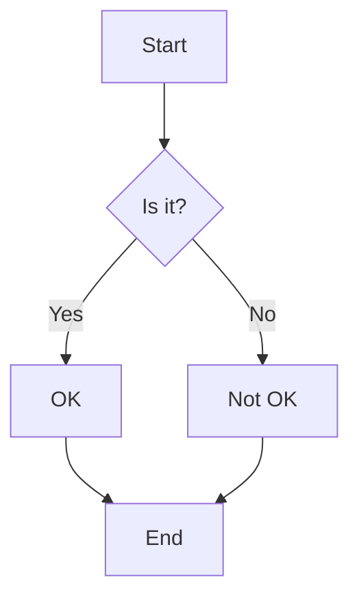

# Mermaid example

This is a simple example of a mermaid diagram bundled into `http-server`.

```mermaid
graph TD
    A[Start] --> B{Is it?}
    B -- Yes --> C[OK]
    B -- No --> D[Not OK]
    C --> E[End]
    D --> E
```

Go back [to the homepage](README.md).
